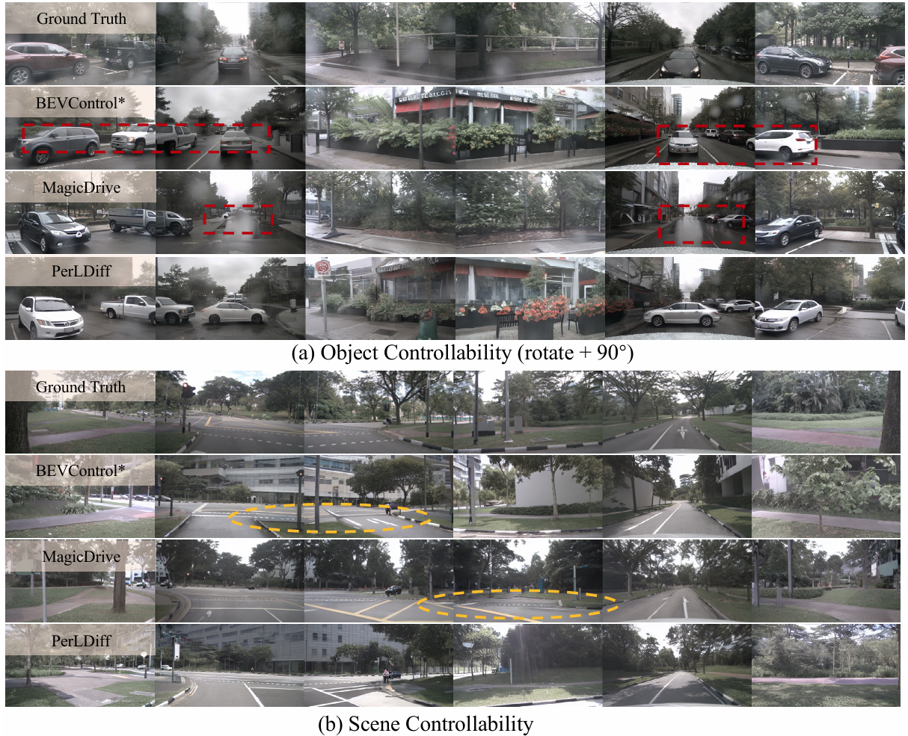
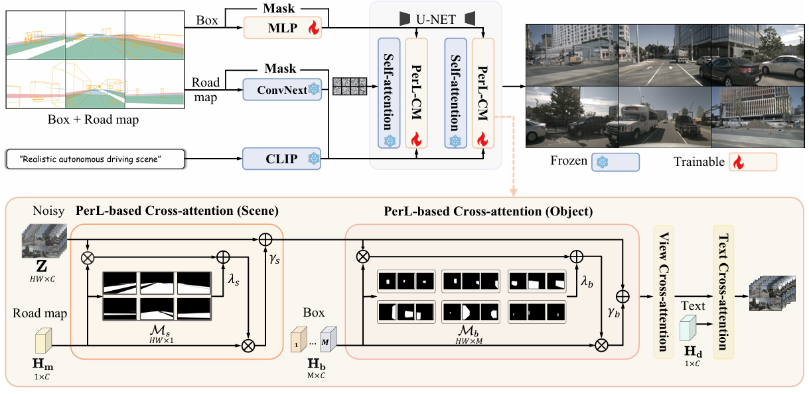

# PerLDiff：Controllable Street View Synthesis Using Perspective-Layout Diffusion Models
This repository is the official PyTorch implementation of PerLDiff: Controllable Street View Synthesis Using Perspective-Layout Diffusion Models.

> Controllable generation is considered a potentially vital approach to address the challenge of annotating 3D data, and the precision of such controllable generation becomes particularly imperative in the context of data production for autonomous driving. Existing methods focus on the integration of diverse generative information into controlling inputs, utilizing frameworks such as GLIGEN or ControlNet, to produce commendable outcomes in controllable generation. 
However, such approaches intrinsically restrict generation performance to the learning capacities of predefined network architectures. In this paper, we explore the integration of controlling information and introduce PerLDiff (\textbf{Per}spective-\textbf{L}ayout \textbf{Diff}usion Models), a method for effective street view image generation that fully leverages perspective 3D geometric information.
Our PerLDiff employs 3D geometric priors to guide the generation of street view images with precise object-level control within the network learning process, resulting in a more robust and controllable output. 
Moreover, it demonstrates superior controllability compared to alternative layout control methods. Empirical results justify that our PerLDiff markedly enhances the precision of generation on the NuScenes and KITTI datasets.
---

**[PerLDiff：Controllable Street View Synthesis Using Perspective-Layout Diffusion Models](https://arxiv.org/abs/2407.06109)**

[Jinhua Zhang](https://nuanbaobao.github.io/), [Hualian Sheng](https://scholar.google.com/citations?user=73JaDUQAAAAJ&hl=zh-CN&oi=sra), [Sijia Cai](https://scholar.google.com/citations?user=LMVeRVAAAAAJ&hl=zh-CN&oi=sra), [Bing Deng](https://scholar.google.com/citations?user=VQp_ye4AAAAJ&hl=zh-CN&oi=sra), [Qiao Liang](https://scholar.google.com/citations?user=-Hv_dPkAAAAJ&hl=zh-CN), [Wen Li](https://scholar.google.com/citations?user=yjG4Eg4AAAAJ&hl=zh-CN), [Ying Fu](https://scholar.google.com/citations?user=PE4xMlkAAAAJ&hl=zh-CN), [Jieping Ye](https://scholar.google.com/citations?user=T9AzhwcAAAAJ&hl=zh-CN), [Shuhang Gu](https://scholar.google.com/citations?user=-kSTt40AAAAJ&hl=zh-CN)

[](https://perldiff.github.io/)
[](https://arxiv.org/pdf/2407.06109)
[](https://github.com/LabShuHangGU/PerlDiff)


<p align="center">
  
<br>
</p>

<p align="center">
  
<br>
<em>PerLDiff utilizes perspective layout masking maps derived from 3D annotations to integrate scene information and object bounding boxes for multi view street scene generation</em>
</p>

## News
- [2024.7.8] ✨  Paper Released!
- [2024.12.2] Code base and checkpoints are released!
- [2025.1.16] Training code released for KITTI dataset; checkpoint preparation is underway.

## Setup

### Installation

Clone this repo with submodules

```bash
git clone -b perldiff-sd1.4-kitti https://github.com/LabShuHangGU/PerLDiff.git
```

The code is tested with `Pytorch==1.12.0` and `cuda 11.3` on V100 servers. To setup the python environment, follow:

Clone this repository, and we use pytorch1.12.0+cu113 in V100, CUDA 11.3:

```bash

conda create -n perldiff python=3.8 -y

conda activate perldiff

pip install albumentations==0.4.3 opencv-python pudb==2019.2 imageio==2.9.0 imageio-ffmpeg==0.4.2 

pip install pytorch-lightning==1.4.2 omegaconf==2.1.1 test-tube>=0.7.5 streamlit>=0.73.1 einops==0.3.0 torch-fidelity==0.3.0 timm

pip install torch==1.12.0+cu113 torchvision==0.13.0+cu113 torchaudio==0.12.0 --extra-index-url https://download.pytorch.org/whl/cu113

pip install protobuf torchmetrics==0.6.0 transformers==4.19.2 kornia==0.5.8 ftfy regex tqdm

# git+https://github.com/openai/CLIP.git 
cd ./CLIP
pip install .
cd ../
# pip install git+https://github.com/openai/CLIP.git
pip install nuscenes-devkit tensorboardX efficientnet_pytorch==0.7.0 scikit-image==0.18.0 ipdb gradio

# use "-i https://mirrors.aliyun.com/pypi/simple/" for pip install will be faster
```


### Datasets

We prepare the KITTI dataset similarly to the instructions in [MonoFlex](https://github.com/zhangyp15/MonoFlex). Please download [KITTI dataset](http://www.cvlibs.net/datasets/kitti/eval_object.php?obj_benchmark=3d) and organize the data as follows:

```
DATA/kitti
  |ImageSets/
  |training/
    |calib/
    |image_2/
    |label/
  |testing/
    |calib/
    |image_2/
```


### Training
Before training, download provided pretrained checkpoint on [Hugging Face](https://huggingface.co/longyer/PerLDiff). Finally, you should have these checkpoints:

```bash
PerLDiff/
    openai
    DATA/
    ├── kitti
    ├── perldiff_256x384_lambda_5_bs2x8_model_checkpoint_00060000.pth
    ├── sd-v1-4.ckpt
```

A training script for reference is provided in `bash_run_train.sh`. 
```bash
export TOKENIZERS_PARALLELISM=false
export CUDA_VISIBLE_DEVICES="0,1,2,3,4,5,6,7" 
OMP_NUM_THREADS=16 torchrun \
            --nproc_per_node=8 main.py \
            --training \
            --yaml_file=configs/kitti_text.yaml   \
            --batch_size=1 \
            --name=kitti_ft_train_384x1280_perldiff_bs1x8 \
            --guidance_scale_c=5 \
            --step=50 \
            --official_ckpt_name=sd-v1-4.ckpt \
            --nusc_ckpt_path=None \
            --total_iters=60000 \
            --save_every_iters=6000 \
            --val_ckpt_name=None \
```
!!! To fine-tune using pretrained weights from Nuscenes, please use `--nusc_ckpt_path=perldiff_256x384_lambda_5_bs2x8_model_checkpoint_00060000.pth`.

### Evaluation and Visualize


A testing script for reference is provided in `bash_run_test.sh`.
```bash
export TOKENIZERS_PARALLELISM=false
CUDA_VISIBLE_DEVICES="8,9" OMP_NUM_THREADS=16 torchrun \
            --nproc_per_node=2 main.py \
            --validation \
            --yaml_file=configs/kitti_text.yaml   \
            --batch_size=2 \
            --name=kitti_test_384x1280_perldiff_bs1x8 \
            --guidance_scale_c=5 \
            --step=50 \
            --official_ckpt_name=sd-v1-4.ckpt \
            --total_iters=60000 \
            --save_every_iters=6000 \
            --val_ckpt_path=None \
```
!!! Please use `--val_ckpt_path= `to specify your training weights.


### Test FID
Before testing FID, you should generate the validation dataset using `bash_run_gen.sh`.

```bash
export TOKENIZERS_PARALLELISM=false
CUDA_VISIBLE_DEVICES="8,9" OMP_NUM_THREADS=16 torchrun \
            --nproc_per_node=2 main.py \
            --generation \
            --yaml_file=configs/kitti_text_with_path.yaml   \
            --batch_size=2 \
            --name=kitti_test_384x1280_perldiff_bs1x8 \
            --guidance_scale_c=5 \
            --step=50 \
            --official_ckpt_name=sd-v1-4.ckpt \
            --nusc_ckpt_path=None \
            --total_iters=60000 \
            --save_every_iters=6000 \
            --val_ckpt_name=None \
            --gen_path=val_kitti_ddim50w5_384x1280_perldiff_bs1x8 \
```

We provide a method for measuring FID:

#### measuring FID: Using [clean_fid](https://github.com/GaParmar/clean-fid)
- The FID calculated by this method tends to be higher. Calculate the FID:
    ```bash
    pip install clean-fid
    python FID/cleanfid_test_fid.py --gen_path/real --gen_path/gen
    ```

## Citation

```
@article{zhang2024perldiff,
  title={PerlDiff: Controllable Street View Synthesis Using Perspective-Layout Diffusion Models},
  author={Zhang, Jinhua and Sheng, Hualian and Cai, Sijia and Deng, Bing and Liang, Qiao and Li, Wen and Fu, Ying and Ye, Jieping and Gu, Shuhang},
  journal={arXiv preprint arXiv:2407.06109},
  year={2024}
}
```

## Related Repositories
https://github.com/zhangyp15/MonoFlex

https://github.com/gligen/GLIGEN/

https://github.com/fundamentalvision/BEVFormer

https://github.com/cure-lab/MagicDrive/

https://github.com/mit-han-lab/bevfusion

https://github.com/bradyz/cross_view_transformers


## Contact

If you have any questions, feel free to contact me through email ([jinhua.zjh@gmail.com](jinhua.zjh@gmail.com)).
